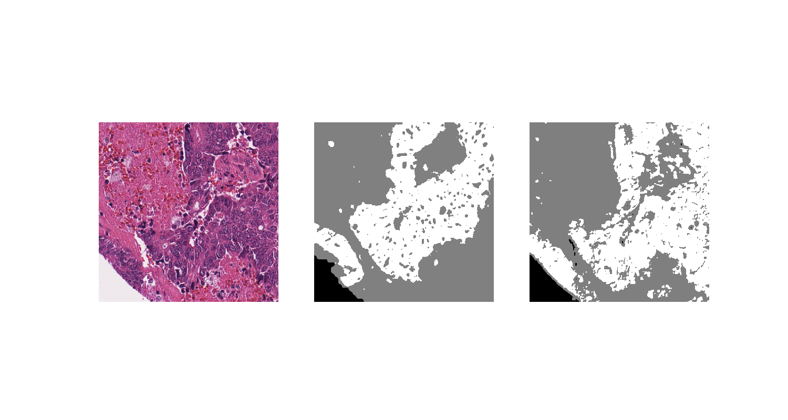

# CRC-Segmentation
## Mini Research Project of the course "Advanced Machine Learning" at the Heidelberg University
Analyzing a 2D Dataset consisting of Colorectal Cancer Tissue Images (Segmentation Task) with a U-Net using the Pytorch library.

A special thanks to Dr. med. Weis and his group who supplied us with the huge data set with over 20.000 crc images and corresponding masks! Moreover thanks to Prof. Dr. Hesser for arranging contact.

### Example prediction by one of the models
Left - Image | Center - Ground Truth | Right - Prediction

